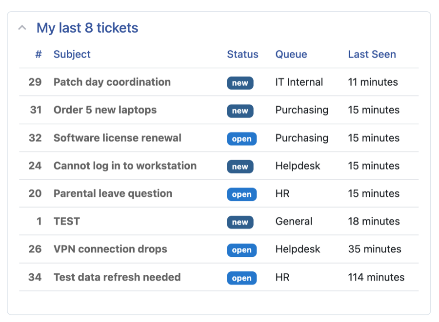

# RT-Extension-HistoryComponent

#### Table of Contents

1. [About](#about)
2. [License](#license)
3. [Support](#support)
4. [Requirements](#requirements)
5. [Installation](#installation)

## About

RT already got a way to see recently viewed tickets. However, it's tucked away in the Tickets dropdown menu
and easy to miss.

This extension provides a simple portlet that looks no other than any other ticket-list portlet. But it moves
the ticket listing from the mentioned menu to a more visible and accessible location: the homepage dashboard,
where it can be added like any other component.

No configuration required.

## License

This project is licensed under the terms of the GNU General Public License Version 2.

This software is Copyright (c) 2018-2026 by NETWAYS GmbH [support@netways.de](mailto:support@netways.de).

## Support

For bugs and feature requests please head over to our [issue tracker](https://github.com/netways/rt-extension-historycomponent/issues).
You may also send us an email to [support@netways.de](mailto:support@netways.de) for general questions or to get technical support.

## Requirements

- RT 6

## Installation

Extract this extension to a temporary location.

Git clone:

    cd /usr/local/src
    git clone https://github.com/netways/rt-extension-historycomponent

Tarball download:

    cd /usr/local/src
    wget https://github.com/NETWAYS/rt-extension-historycomponent/archive/master.zip
    unzip master.zip

Navigate into the source directory and install the extension. (May need root permissions.)

    perl Makefile.PL
    make
    make install

Edit your `/opt/rt6/etc/RT_SiteConfig.pm`

Add this line:

    Plugin('RT::Extension::HistoryComponent');

Clear your mason cache:

    rm -rf /opt/rt6/var/mason_data/obj

Restart your webserver.
